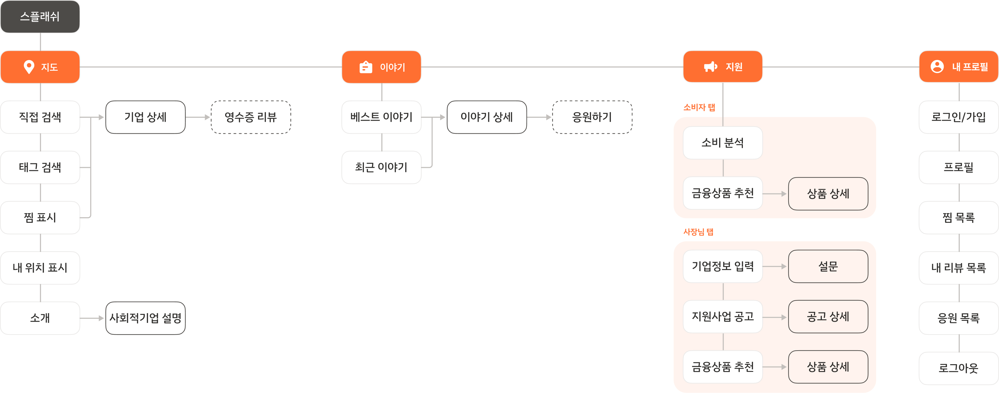
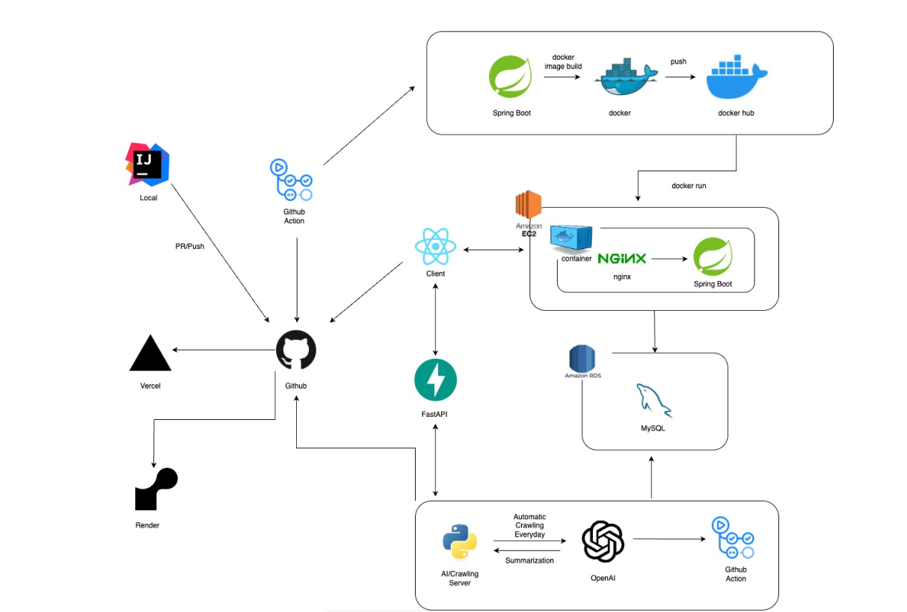
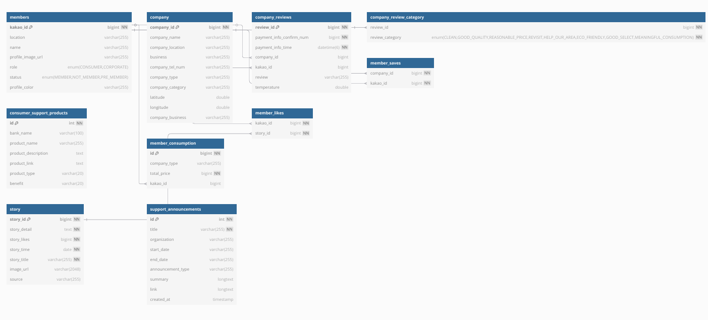
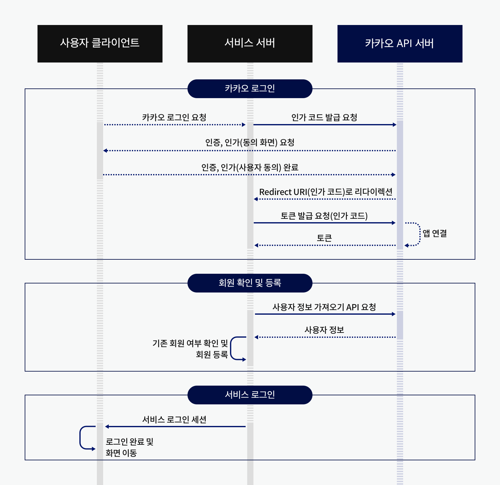
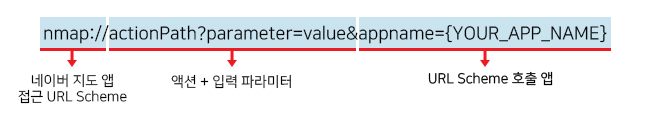

# 백엔드 Readme 정리

# 🌱 모락(MORAK) — 서울을 더 따뜻하게 만드는 가치소비 플랫폼

## ‘가치 있는 소비는 어떻게 시작될 수 있을까?’

**모락(Morak)**은 사회적기업과 시민을 연결해 **서울시의 착한 소비 생태계를 확산**시키는 플랫폼입니다.

복잡하고 단편적인 사회적기업 정보를 하나로 통합하고, 위치 기반 탐색·감성 리뷰·맞춤형 금융 추천 기능을 통해 누구나 **쉽게, 공감하며, 지속가능한 소비를 경험할 수 있도록** 설계했습니다.

이 프로젝트는 2025 서울시 공공데이터 공모전 출품작으로, 서울시가 제공하는 **사회적기업 공공데이터를 기반**으로 만들어졌으며, MZ세대 소비자의 ‘미닝아웃’ 트렌드와, 홍보에 어려움을 겪는 사회적기업의 실태를 **기술과 서비스 디자인으로 연결**했습니다.

# IA (Information Architecture)
<p align="center">
  
</p>

# System Architecture

<p align="center">
  
</p>

# ERD

<p align="center">
  
</p>

# **⚙️ 기술 스택**

- Spring Boot
- Spring Security (JWT + OAuth2)
- Spring Data JPA
- MySQL
- NAVER OCR API
- SpringDoc (Swagger/OpenAPI)
- AWS EC2, RDS, S3
- GitHub Actions

# **✅**CI/CD

본 프로젝트는 GitHub Actions를 활용하여 CI/CD 파이프라인을 구축하였고, 실제 서비스 배포는 AWS EC2 환경에서 이루어졌습니다. 주요 배포 및 운영 구성은 다음과 같습니다:

- **CI/CD 자동화**
    - **GitHub Actions**를 사용하여 코드 푸시 시 자동으로 테스트 및 빌드가 수행되며, 성공 시 EC2 서버에 배포됩니다.
    - **Dockerfile** 및 **docker-compose.yml**을 기반으로 애플리케이션을 컨테이너화하고 자동 배포되도록 구성하였습니다.

# **✅ 배포 아키텍처 개요**

본 프로젝트는 하나의 AWS EC2 인스턴스에 **Nginx와 Spring Boot 애플리케이션을 함께 설치**하여 운영 중입니다. Nginx는 **리버스 프록시 역할**을 수행하며, 외부에서 들어오는 HTTPS 요청을 내부 애플리케이션 서버(예: 8080 포트)로 안전하게 전달합니다. 이를 통해 보안성과 성능을 동시에 확보하였습니다.

- **서버 환경**
    - **AWS EC2**를 이용해 백엔드 서버를 구축하였으며, 고정된 IP를 할당하여 인스턴스 재시작 시에도 접근 주소가 변하지 않도록 설정했습니다.
    - 데이터베이스는 **AWS RDS(MySQL)** 를 사용하여 안정적이고 확장 가능한 데이터 저장소를 구성했습니다.
- **HTTPS 보안 연결**
    - 웹 서비스 보안을 위해 **Nginx**를 리버스 프록시로 설정하고, **Certbot**을 통해 SSL 인증서를 적용하여 HTTPS 배포를 완료했습니다.
- **도메인 및 서브도메인 구성**
    - **가비아**에서 도메인을 구매하고, 프론트엔드(morak.site)와 백엔드(api.morak.site)에 각각 서브도메인을 적용하였습니다.
    - 동일한 도메인 계층 구조 내에서 운영함으로써, **쿠키를 활용한 인증 및 세션 관리**가 원활하게 이루어지도록 했습니다.

# **✅ 로그인 방식**

<p align="center">
  
</p>

본 프로젝트는 **카카오 OAuth2.0 로그인 방식**을 도입하여 간편하고 안전한 사용자 인증을 구현했습니다. 인증 과정에서 발급된 Access Token은 다음 두 가지 방법 중 하나로 프론트엔드에 전달할 수 있었습니다:

1. **쿼리 파라미터 전달**
2. **HTTP Only 쿠키 전달**

보안상의 이유로 **Access Token을 HTTP Only 쿠키에 담아 전달**하는 방식을 선택하였습니다. 이 방식은 클라이언트 측 JavaScript로 토큰에 접근할 수 없도록 하여 **XSS 공격을 방지할 수 있다는 장점**이 있습니다.

---

### **⚠️ 쿠키 전달 문제와 해결 과정**

초기 개발 단계에서 쿠키가 프론트엔드에 제대로 전달되지 않는 문제가 발생했습니다. 이는 **다음과 같은 조건이 충족되지 않아서 발생한 문제**였습니다:

- 프론트엔드와 백엔드가 **서로 다른 도메인**을 사용하고 있어, CORS 정책에 의해 요청이 도달하지 못하고 있었음.
- 프론트엔드, 백엔드 모두 **HTTP를 사용했기** 때문에, Secure, SameSite=None 설정이 적용된 쿠키가 전달되지 않았음.

### ❗**해결 방법**

- 프론트와 백엔드 모두 **HTTPS로 배포**
- **가비아 도메인을 이용해 같은 최상위 도메인**(morak.site)을 같게 하였습니다.
    - 프론트: morak.site
    - 백엔드: api.morak.site
- 백엔드에서 Set-Cookie 헤더에 다음 설정을 적용:
    - `HttpOnly; Secure; SameSite=None`

이러한 설정을 통해 **브라우저가 크로스 도메인 간에도 쿠키를 안전하게 주고받을 수 있게 되었으며**, 로그인 이후 클라이언트가 인증 토큰을 자동으로 유지할 수 있는 환경을 성공적으로 구축했습니다.

# **✅ 인증 및 인가 처리 방식**

본 프로젝트는 사용자 인증과 인가를 명확히 분리하여 처리함으로써, **보안성과 유연한 접근 제어를 동시에 확보**하였습니다.

### **🔐 인증 (Authentication)**

- Spring에 **별도의 커스텀 필터**를 등록하여, 모든 요청에 대해 인증 처리를 수행
- 내부적으로 **화이트리스트(white list)** URL 목록을 관리하여,
    - 로그인, 회원가입 등 인증이 필요 없는 경로는 필터를 통과
    - 그 외 요청에 대해서는 **쿠키에 포함된 Access Token을 검증**
    - 브라우저가 서버에 실제 요청을 보내기 전에 **Preflight 을 전송하는데, 이는 인증, 인가 확인의 대상이 아니므로 화이트리스트에 넣어야 합니다.**
- 화이트리스트 내에 없는 URL인데 Access Token이 없거나, 유효하지 않으면 **401 Unauthorized** 에러를 반환하고,

  유효한 토큰인 경우에는 사용자 정보를 SecurityContext에 등록하여 인증 처리


### **🔒 인가 (Authorization)**

- **Spring Security의 SecurityConfig 클래스**를 통해 요청 경로별 접근 권한을 제어
- 역할(Role) 기반으로 권한을 분리하고, 특정 경로는 로그인 사용자만 접근 가능하도록 제한

이와 같은 구조를 통해, 인증된 사용자만 서비스에 접근할 수 있도록 하고,

각 기능에 따라 세분화된 인가 정책을 적용하여 **서비스 보안을 강화**하였습니다.

# **✅** Naver CLOVA OCR

- 기업에서 소비한 영수증을 리뷰에 사용할 수 있도록 네이버 영수증 리뷰 기능을 사용할 수 있도록 했습니다.
- 이때 Naver 측에서 제공하는 CLOVA OCR 중 영수증 특화 인식 모델을 신청하여 영수증에서 유의미한 정보를 추출할 수 있게 하였습니다.
- 영수증에서 추출한 기업 주소와 실제 기업의 주소 값을 비교하여 영수증이 해당 기업이 맞는지 아닌지 판단하였습니다.

### ⭕ **영수증 정보와 실제 기업 정보 비교 방법**

OCR을 통해 추출된 영수증의 가맹점 정보(주소 또는 상호명)를 실제 DB에 저장된 기업 정보와 비교하여 **동일한 업체인지 판별하는 로직**을 구현하였습니다.

### **📌 비교 기준 및 이유**

- 일반적으로 **상호명은 중복 가능성이 높고, OCR 인식 오류도 많아 신뢰도가 낮음**
- 반면, **주소는 상대적으로 고유성이 높고 오타가 적으며, 실질적으로 동일 업체 여부를 판별하기에 더 적합함**

따라서, 본 프로젝트에서는 **주소 기반 비교**를 우선적으로 사용하였으며, 다음과 같은 방식으로 유사도를 계산하였습니다:

### ⭕  **유사도 비교 방식**

- Apache Commons Text의 LevenshteinDistance 알고리즘을 사용
- 기업의 주소와 영수증 주소를 전처리(normalize) 후, 편집 거리를 계산하여 유사도를 측정
- 유사도 = 1 - (편집 거리 / 최대 문자열 길이)
- **유사도가 80% 이상이면 동일 업체로 간주**, 아니면 다른 업체로 판단

### **🧠 적용 예시**

```jsx
normalizedCompanyAddress = "서울특별시강남구도곡동"
normalizedReceiptAddress = "서울시강남구도곡동"
→ 편집거리 = 4, 최대길이 = 13
→ 유사도 = 1 - (4 / 13) ≈ 0.692 → 다른 업체로 판단
```

# **✅ 지도**

- 기업을 카테고리, 타입별로 구별하였습니다.

```java
public enum CompanyCategory {
    ETC("기타"),
    SHOPPING("쇼핑"),
    COMPLEX_SPACE("복합공간"),
    LIVING_SERVICE("생활서비스"),
    EDUCATION("교육/지원"),
    IT_DIGITAL("IT/디지털"),
    RESTAURANT("음식점"),
    CAFE("카페"),
    MANUFACTURING_TRANSPORTATION("제조/운송"),
    CULTURE_ART("문화/예술");
}
```

```java
public enum CompanyType {
    PRE("예비"),
    SOCIAL_SERVICE("사회서비스제공형"),
    JOB_PROVISION("일자리제공형"),
    COMPANY_CONTRIBUTION("지역사회공헌형"),
    MIXED("혼합형"),
    ETC("기타(창의ㆍ혁신)형");
}
```

- 공공데이터를 통해 얻은 기업의 주소를 geocoding을 이용해 위도, 경도를 추출해 DB에 저장했습니다.

# **✅ 네이버 지도 길찾기**

- 네이버 지도 앱 URL Scheme은 `nmap://`으로 시작하며, 구문의 형식은 다음과 같습니다.

<p align="center">
  
</p>

| 구성 요소 | 설명 | 필요 여부 |
| --- | --- | --- |
| nmap:// | 네이버 지도 앱 접근 URL Scheme | 필수 |
| actionPath | 호출 액션 | 필수 |
| parameter=value | 호출 액션에 따른 입력 파라미터와 입력 값 | 액션에 따라 다름.  |
| appname | URL Scheme을 사용하는 앱 또는 웹 페이지를 식별하는 문자열 | 필수. |

## 도보 길찾기

- 액션 경로: `'/route/walk'`
- 경로 탐색 공통 파라미터

| 파라미터 | 타입 | 필수 여부 | 설명 |
| --- | --- | --- | --- |
| slat | double | N | 출발지 위도 |
| slng | double | N | 출발지 경도 |
| sname | string | N | 출발지 이름 (URL 인코딩된 문자열) |
| dlat | double | Y | 도착지 위도 |
| dlng | double | Y | 도착지 경도 |
| dname | string | N | 도착지 이름 (URL 인코딩된 문자열) |

## 도보 길찾기 API

📌 기능 요약

| 기능  | 설명 | Method | API |
| --- | --- | --- | --- |
| 도보 길찾기 | 현재 위치에서 목적지 까지 도보거리 길찾기 | GET | /geocoding/nmap |

# **✅ 리뷰**

### ✍️ 리뷰 작성 및 관리

- 회원은 기업 상세 페이지에서 리뷰를 남길 수 있으며, 온도와 함께 **리뷰 카테고리(청결함, 재방문의사 등)**를 선택해 리뷰를 남길 수 있습니다.
- 리뷰는 **작성, 수정, 삭제, 조회, 페이징**, 그리고 **리뷰의 평균 온도**, **총 개수 집계** 기능 등을 지원합니다.

📌 기능 요약

| 기능 | 설명 | Method | API |
| --- | --- | --- | --- |
| 리뷰 등록 | 회원이 기업에 대한 리뷰와 온도, 카테고리 선택 가능 | POST | /reviews/write |
| 리뷰 수정 | 본인이 작성한 리뷰만 가능 | POST | /reviews/update/{reviewId} |
| 리뷰 삭제 | 본인이 작성한 리뷰만 가능 | DELETE | /reviews/{reviewId} |
| 기업별 전체 리뷰 | 기업 상세 페이지에 적용 | GET | /reviews/public/get-company-reviews |
| 기업별 페이지 리뷰 조회 | 기업 상세 페이지에 적용 | GET | /reviews/get-company-reviews |
| 기업별 리뷰 개수 조회 | 기업 상세 페이지에서 총 리뷰 개수 조회 | GET | /reviews/public/get-count-company-review |
| 기업별 평균 온도 및 리뷰 개수 | 리뷰 통계를 위한 데이터 제공 | GET | /reviews/public/get-temperature |
| 회원별 리뷰 목록 조회 | 마이페이지에서 본인의 리뷰 확인 가능 | GET | /reviews/get-all-member-reviews |
| 회원별 작성 리뷰 개수 조회 | 마이페이지에서 본인의 작성 리뷰 개수 확인 가능 | GET | /reviews/get-count-member-review |

🛠 주요 기술

- `@ElementCollection` 기반 다중 카테고리 저장

```java
public enum ReviewCategory {

    MEANINGFUL_CONSUMPTION, // 의미있는 소비였어요
    ECO_FRIENDLY,   // 친환경적인 제품이에요
    GOOD_QUALITY,   // 제품 
    품질이 좋아요
    GOOD_SELECT, // 같이 사는 사회를 위한 좋은 선택 같아요
    HELP_OUR_AREA, // 우리지역에 도움이 돼요
    REASONABLE_PRICE, // 가격이 합리적이에요
    CLEAN, // 청결해요
    REVISIT // 다시 방문하고 싶어요
}
```

- `JwtAuthenticationFilter`에서 사용자 인증 후 `SecurityContext` 주입
- 기업 ID 기반 조회 시 `Sort.by(Sort.Direction.DESC, "reviewId")` 정렬

# **✅ 스토리**

### 📰 기업 스토리 공유

- **스토리 기능은 기업의 사회적 가치 경험을 공유**하는 콘텐츠 플랫폼입니다.
- 좋아요 기능과 함께 **인기 스토리 TOP 3**, **전체 스토리 목록**, **스토리 상세 조회** 기능 등을 제공합니다.

📌 기능 요약

| 기능 | 설명 | Method | API |
| --- | --- | --- | --- |
| 전체 스토리 목록 조회 | 최신순 정렬 | GET | /story/public/all |
| 스토리 상세 조회 | 스토리 ID로 해당 스토리 상세 조회 | GET | /story/public/detail/{storyId} |
| 인기 스토리 TOP3 | 좋아요 개수가 가장 많은 3개 스토리 조회 | GET | /story/public/best |
| 응원하기 | 사회적 기업의 스토리를 응원 | PATCH | /story/likes/{storyId} |
| 응원하기 취소 | 스토리 응원을 취소 | PATCH | /story/dislikes/{storyId} |
| 응원한 스토리 목록 | 내가 응원한 스토리 목록 조회 | GET | /story/member-likes |
| 응원한 스토리 개수 | 내가 응원한 스토리 개수 조회 | GET | /story/count-member-likes |

### 🛠 주요 기술

- `MemberStoryLikes` 테이블로 좋아요 관계 관리 (Many-to-Many 대응 구조)
- 인증된 사용자만 좋아요 등록/취소 가능

# **✅ 지원**

### 📣 사회적경제 지원 공고 조회

- 서울시에서 제공하는 다양한 사회적경제 **지원 사업 공고 정보를 제공**합니다.
- 사용자는 프리뷰 리스트로 전체 공고를 확인하고, 클릭 시 상세 내용을 조회할 수 있습니다.

📌 기능 요약

| 기능 | 설명 | Method | API |
| --- | --- | --- | --- |
| 지원 공고 프리뷰 조회 | 공고 제목 + 모집 기간 요약 조회 | GET | /support/public/preview |
| 공고 상세 조회 | 공고 ID를 통해 공고의 전체 정보 조회 | GET | /support/public/detail/{productId} |
| 소비자 지원 상품 조회 | 소비자 관련 지원 상품 모두 조회 | GET | /support/public/consumer/preview |
| 소비자 지원 상품 상세 조회 | 상품 ID를 통해 지원 상품의 전체 정보 조회 | GET | /support/public/consumer/detail/{productId} |

### 🛠 주요 기술

- `지원공고` 도메인은 크롤링 기반 정기 업데이트
- `id` 기반으로 상세 조회 가능합니다.

# **📚 문서 접근**

- Swagger UI(local): [http://localhost:8080/swagger-ui/index.html](http://localhost:8080/swagger-ui/index.html)
- Swagger UI: [https://api.morak.site/swagger-ui/index.html](https://api.morak.site/swagger-ui/index.html)
